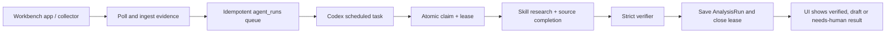

# Hosting and automation — compact boundary

**Status:** deferred until the local evidence, scenario and evaluation gates
pass. The session-triggered local workflow is the default; see
[`plan-research-platform.md`](plan-research-platform.md) §7 and RT.7.

## Recommended topology

- Vercel: Next.js UI and route-handler proxy.
- Railway: FastAPI plus PostgreSQL, with backups and restricted service access.
- Short-lived jobs: source ingestion, notifications or hosted polling only if
  the watermark-based local workflow proves insufficient.
- Codex: supervised local operator/reviewer. Personal Codex credentials never
  live in the hosted app.

## Local two-process flow

The complete local flow is deliberately split at a durable database boundary:



The app can be one collector/API process. It should not silently invoke an AI
subprocess: the Codex task is the explicit operator boundary, has no dependency
on an OpenAI API key, and can use the model selected on the queue row. A
scheduled Codex task is the preferred unattended worker; it should run every
10–15 minutes, recover expired leases, claim at most one row, and stop on an
empty queue.

Suggested scheduled-task prompt:

> In `/Users/jgulinski/Claude/Projects/stocks-analyzis`, read
> `.codex/tasks/stock-queue-worker.md`. Run `./workbench doctor`, recover
> expired agent leases, claim at most one queued run, follow its requested
> workflow/model contract, heartbeat during long work, and save a structured
> verifier-gated result with the same `agent_run_id`. If the queue is empty,
> stop successfully. Never use an OpenAI API key or invent missing evidence.

The UI model selector is the source of the requested model for a row. If a row
has no model selection, the scheduled worker may default to the configured
orchestrator policy (Terra high for workers, Sol high for deep analysis and
strict verification); the app records the
request but never claims the host's concrete deployment when it is not exposed.

## Operating boundary

Hosted jobs may fetch sources, persist evidence and create a review queue. They
must not silently run or approve investment analysis, rewrite a thesis, or
present unverified output. Every run needs source, `as_of`, skill/model,
cost/status and verifier provenance.

## Opt-in periodic variant (CX.15d)

The default remains session-triggered: `./workbench start` runs the local
pre-session hook once and stops at the durable queue claim boundary. No daemon,
cron entry or hosted scheduler is installed by the repository.

If a user deliberately enables periodic polling, schedule only the existing
pre-session ingestion command, for example:

```bash
cd /Users/jgulinski/Claude/Projects/stocks-analyzis/backend
python scripts/codex_pre_session.py --trigger local-schedule --pretty
```

The job may poll ESPI/EBI and create one `stock-pre-session-brief` queue item
after complete ingestion. It must not call `process-one`, claim work, invoke a
model, or approve a result. The scheduled runner must prevent overlapping
invocations and keep source politeness/rate limits enabled. A failed or
incomplete poll remains visible as `ok: false` and must not create a queue item.

A hosted scheduler may use the same private API contract at
`POST /api/agent-runs/pre-session`, but only behind deployment authentication
and network access controls. Hosted polling is still ingestion-plus-queueing;
Codex remains the supervised local operator and owns claim, research,
verification and save. Personal Codex or provider credentials never move to the
hosted job.

## Keyless local Codex integration

No OpenAI API key is required for the local workflow. Start the app with
`./workbench start`; `.codex/config.toml` registers the local
`stock_workbench` stdio MCP server. In a Codex task, read the claimed queue row,
use `get_company_dossier` and the matching stock skill, then save through
`save_analysis_run` and `mark_verification_result`. The app remains the system
of record and the Codex session remains the supervised worker/verifier.

When MCP is unavailable, use the equivalent JSON scripts under
`backend/scripts/`: `codex_pick_agent_run.py`,
`codex_heartbeat_agent_run.py`, `codex_recover_agent_runs.py`,
`codex_save_analysis.py` and `codex_mark_verification.py`. Both paths stop at
the same durable claim and strict-verification boundaries; neither invokes a
hosted model or reads an OpenAI key.

## Notifications

Add Slack/email only after the queue and event contracts are stable. Messages
should identify company, event/source, freshness, severity and a link back to
the case; never include secrets or imply a buy/sell instruction.

## Gates

Before deployment: green tests, reproducible frontend build, auth, backups,
monitoring, source politeness, rate/cost limits, failure recovery and a
manual verification path. See `TASKS.md` RT.7 and the project guardrails.
