# Stage plan - Codex-centered analyst operating system (stage CX)

**Status:** in progress 2026-07-09. CX.1-CX.8 are complete; CX.9 is a
compatibility runway; CX.10-CX.14 are active/planned gates. Owner:
implementation sessions per WP.
**Read alongside:** `PLAN.md` sections 2, 4, 7, 8 and 10; `TASKS.md` Phase 5
for the current Claude-shaped implementation to replace; `skill/SKILL.md` and
`skill/rubric.md` for the existing strategy contract; `docs/strategy-malik.md`
for the investment method; `docs/plan-stage-scenarios.md` for the current
deterministic-first scenario and valuation engines.

## Goal

Pivot the app from "backend calls Claude API" to "Codex operates the app through
repo skills, local scripts and MCP tools, while the web UI reads verified
results from Postgres." The app stays useful without Codex running: scrapers,
deterministic metrics, scenarios, backtests and saved analyses remain in the
database. Codex becomes the brain and facilitator that gathers context, runs
workers, verifies their work, and saves structured outputs for the UI.

This stage is local-desktop-first. A ChatGPT/Codex subscription gives Codex
agent usage in the app/CLI/IDE. It is not a drop-in backend API key. Backend
endpoints should not try to call a subscription-entitled Codex model directly.
Instead, Codex uses tools that read and write the app's local database/API.

## Current State

- Active user-facing path: provider-neutral `agent_runs`, `analysis_runs`,
  `verification_runs`, local JSON scripts, MCP tools and workflow status.
- Compatibility path: legacy `analyses` table, direct Phase-5 analysis route
  and provider-specific transport modules still exist until the sunset/archive
  work package. They are not the direction of travel.
- Company-analysis quality gate: quick/deep Codex outputs must pass the
  `stock-result-verifier` feedback loop before they can be saved as verified.
  Approved outputs need structured `prediction`, deterministic `potential`, and
  `result_quality` fields so later agent-evaluation backtests do not infer
  direction from prose.
- Scenario state: C/Z scenarios use BiznesRadar `/prognozy` consensus net
  income as forward EPS when present and internally sane, and disclose that
  driver in scenario assumptions. Empty consensus columns are treated as absent
  data, not fabricated forecasts.
- Backtest state: multi-asset deterministic replay is wired, but current local
  data is not sufficient for meaningful historical fundamental-signal learning.
  The DB has four stored companies with recent prices only; financial rows were
  scraped after those price dates, so point-in-time replay correctly reports
  `insufficient_data`.
- Documentation source of truth: `TASKS.md` tracks status, this plan defines
  architecture/path, and `CHANGELOG.md` records decisions plus verification.

## Target System

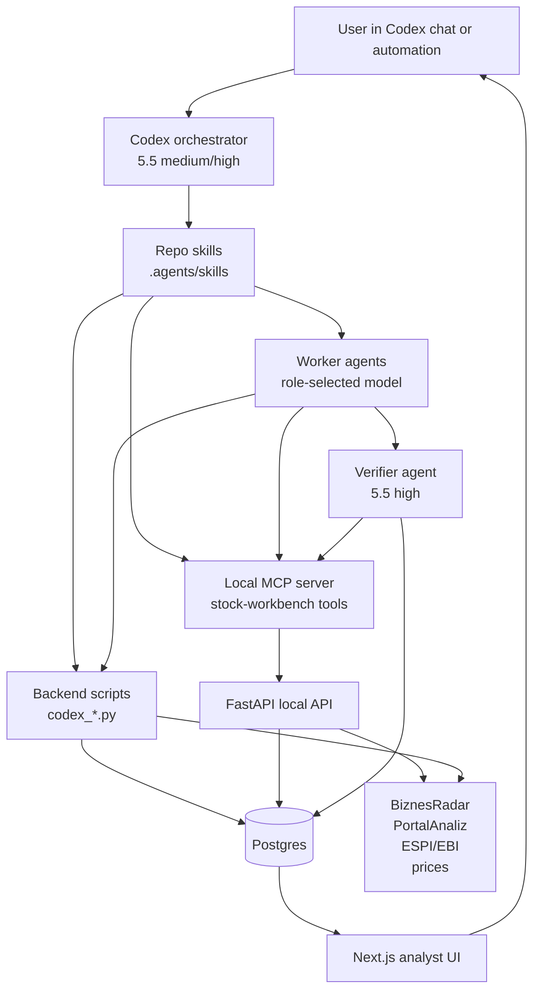

### Durable rule

Codex reasoning is not the source of truth. A result becomes part of the app
only after it is written as structured data and, for important workflows,
verified. The UI renders database rows, not chat memory.

### Role enforcement rule

Every persisted Codex-created row must record `workflow`, `model_role`,
`model`, `agent_run_id`, and `verification_status`. The verifier checks role
discipline as part of quality:

- Routine task used `worker_standard` unless the run records a specific escalation
  reason.
- Deep synthesis used `analyst_deep` only after the dossier/source snapshot was
  already gathered.
- UI-visible output passed `verifier_strict`.
- Rejected output remains visible as an audit row, not as an approved analysis.

## Supervised Agent Policy

Simple work should use the model that is precise enough for the risk of the
task. In this project that means precision-first model selection: lighter
models are acceptable for deterministic extraction, formatting, and clearly
bounded summaries, but analysis that can change an investment view uses a
stronger model and always gets supervised verification before it becomes
visible in the app. Treat subscription quota models as Codex workflow capacity,
not as a backend API budget.

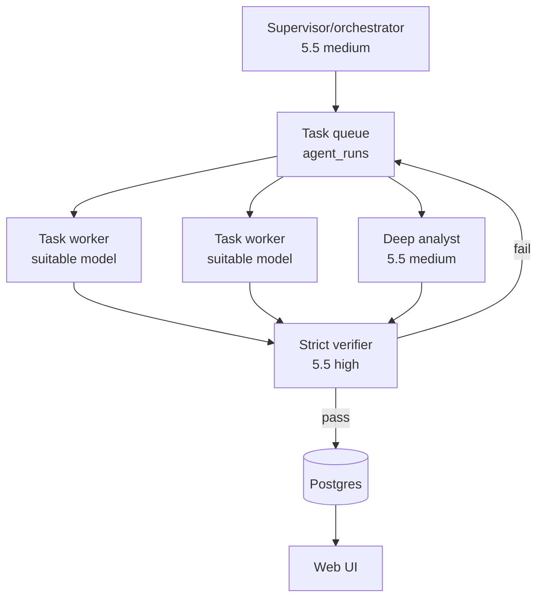

Routing rules:

- Use `worker_standard` for deterministic data gathering, ESPI/EBI triage, forum
  claim extraction, simple refresh summaries, candidate prefiltering, and
  schema formatting.
- Use `analyst_deep` only when the task requires synthesis across fundamentals,
  events, forum context, scenarios and backtest evidence.
- Use `verifier_strict` for every result that will be displayed as a verified
  investment analysis, candidate recommendation, or backtest conclusion.
- If a worker fails verification twice, escalate the next attempt to
  `analyst_deep` and keep the failed verifier notes in `agent_runs`.
- Codex may run multiple `worker_standard` agents in parallel only when their write
  targets are disjoint or they are producing drafts that the orchestrator will
  merge before saving.

## Model Roles

Use model role names in workflow specs rather than hard-coding a single model
everywhere:

| Role | Default | Job |
|---|---|---|
| `orchestrator` | `gpt-5.5` medium/high | Plan the run, choose tools, merge worker outputs, decide next step. |
| `worker_standard` | suitable model by task risk; use `gpt-5.3-codex-spark` for bounded loops and `gpt-5.5` when a summary can change an investment view | ESPI triage, candidate/backtest sweeps, forum claim extraction drafts, routine refresh notes, JSON formatting. |
| `analyst_deep` | `gpt-5.5` medium/high | Full company thesis, scenario read, backtest interpretation, candidate memo. |
| `verifier_strict` | `gpt-5.5` high | Check source grounding, fabricated numbers, look-ahead bias, schema completeness, and whether output should be visible in UI. |

If a named model is unavailable in a surface, the skill should ask Codex to use
the best available model for the role and task risk. The workflow contract is
more important than the exact model string.

### Delegation Matrix

Use `gpt-5.3-codex-spark` loops for bounded, checkable work:

- doc consistency sweeps across `TASKS.md`, this plan, changelog and skills;
- candidate scans over stored companies;
- repeated deterministic backtest runs and anomaly summaries;
- schema/JSON formatting, fixture summaries and grep-based dead-text checks.

Use 5.5 supervision or stronger analyst/verifier roles for:

- changing what legacy code is removed vs retained;
- interpreting backtest evidence as a strategy-quality conclusion;
- modifying strategy weights, prediction rules or investment thesis policy;
- saving UI-visible verified analysis, candidate recommendations or learning
  notes.

## Core Data Shape

Add provider-neutral storage before deleting the old Claude path:

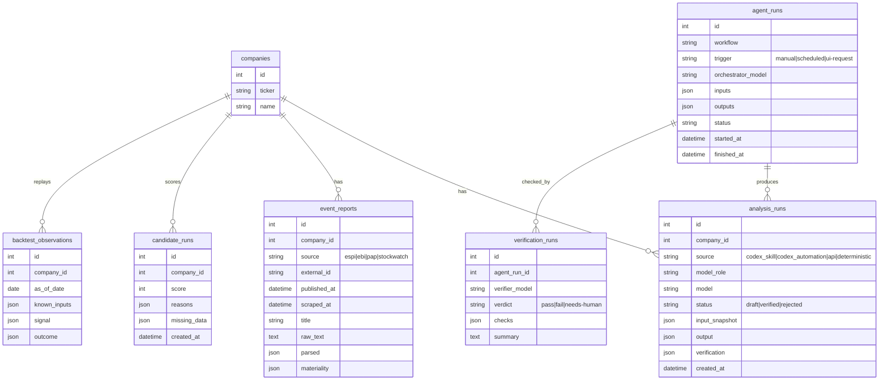

`analysis_runs` can initially wrap the existing `analyses` table, but the target
is provider-neutral. Keep `input_snapshot` mandatory for serious analysis so
the verifier and future backtests can replay what was known at the time.

## Flow 1 - Pre-Session Brief

Purpose: before an investing session, refresh watched companies, ingest new
events, and give the user a concise agenda.

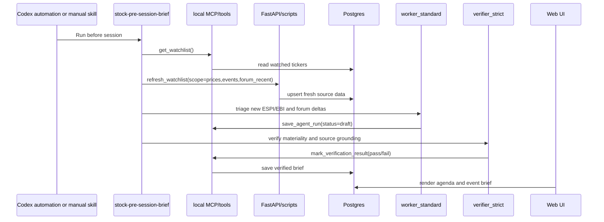

Required tools:

- `get_watchlist`
- `refresh_watchlist`
- `poll_espi_watchlist`
- `get_recent_source_deltas`
- `save_agent_run`
- `mark_verification_result`

UI result: dashboard section `Today`, with new reports, changed theses,
companies needing human attention, and links to affected stock pages.

Agent routing:

- `worker_standard` handles source deltas and first-pass event materiality.
- `orchestrator` merges the agenda and decides whether a deep analysis is
  needed.
- `verifier_strict` checks only items marked material or UI-visible.

## Flow 2 - Compact Company Analysis

Purpose: precise first read after adding or refreshing a ticker, scoped tightly
enough to run quickly without becoming a full investment memo.

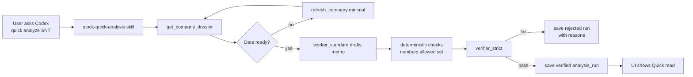

Completeness checks:

- The memo must cite only numbers present in the dossier, event reports, or
  deterministic scenario output.
- Forum claims remain labelled as unverified opinions.
- Missing data must be explicit, not silently filled by the model.
- Output must include `prediction`, `potential`, `result_quality`, `thesis`,
  `watch_items`, `red_flags`, `data_gaps`, `next_action`, and `confidence`.
- `potential.value_pct` must come from deterministic dossier values such as
  `valuation.potential.value_pct` or `scenarios.weighted_expected_upside_pct`;
  `prediction.direction` must explain that value and name its source fields.
- `result_quality` must explain latest result cause, one-off risk, scenario
  validity, and copied scenario warnings.

Agent routing:

- Always start with `worker_standard`.
- Run `stock-result-verifier` as a correction loop before the general strict
  verifier; after two failed correction loops, save rejected or escalate to
  `analyst_deep`.
- Save as `verified` only after `verifier_strict` passes the result.
- On failure, save a rejected draft with verifier reasons and either retry once
  with `worker_standard` or escalate to `analyst_deep`.

## Flow 3 - Deep Company Analysis

Purpose: the "extraordinary analysis" path for a company you may act on.

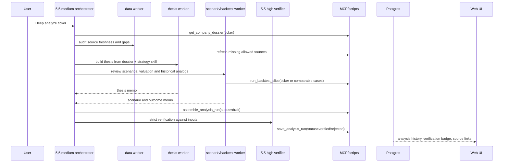

Deep output schema:

- `executive_read`: one-page decision memo.
- `thesis`: catalyst, durability, why now, what would invalidate it.
- `evidence`: facts by source with dates.
- `valuation`: deterministic scenarios plus model interpretation.
- `prediction`: direction, intended horizon and source fields.
- `result_quality`: latest result cause, one-off risk, scenario validity and
  scenario warnings.
- `risks`: accounting, governance, liquidity, one-offs, source quality.
- `forum_context`: claims to verify, never facts.
- `backtest_context`: comparable historical setup and outcome, if available.
- `action_plan`: what to check before decision, after next report, and after
  material ESPI/EBI.
- `verification`: verifier result and failed checks if any.

Agent routing:

- `orchestrator` splits work into data audit, thesis, scenario/backtest and
  risk-review subtasks.
- Routine subtasks still go to `worker_standard`; only synthesis goes to
  `analyst_deep`.
- `verifier_strict` must run after the merged memo, not only after individual
  subtasks.
- `stock-result-verifier` runs first on result cause, potential and scenario
  wording; the general verifier then checks source grounding, schema completeness
  and model-role discipline.

## Flow 4 - Candidate Scout

Purpose: find next potential watchlist candidates without broad unsafe crawling.

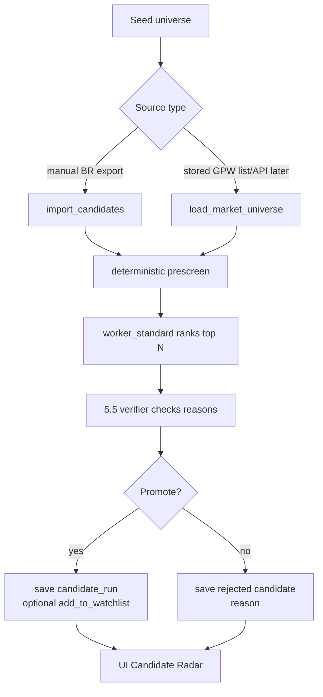

Initial candidate sourcing should be conservative:

- Start with manual BiznesRadar/GPW exports or user-provided ticker lists.
- Add broad crawling only after fixture-tested source rules and rate limits.
- Candidate ranking should separate "interesting" from "actionable"; most
  candidates should remain unpromoted until refreshed and verified.

Agent routing:

- `worker_standard` ranks and explains many candidates efficiently, using a
  stronger model when the ranking reason depends on non-trivial judgment.
- `verifier_strict` reviews only the top shortlist and rejected promotions.
- `analyst_deep` is used only for candidates you are close to adding to the
  watchlist or analyzing deeply.

## Flow 5 - Backtest And Learning Loop

Purpose: learn from past and future examples without look-ahead bias.

```mermaid
flowchart LR
    A[Pick as_of_date] --> B[build point-in-time snapshot]
    B --> C[run deterministic strategy]
    C --> D[optional Codex interpretation]
    D --> E[save signal]
    E --> F[attach future outcomes\n30/90/180/365d]
    F --> G[compare signal vs outcome]
    G --> H[5.5 high verifier\nlook-ahead audit]
    H --> I[store backtest_run]
    I --> J[UI Backtest Lab]
    J --> K[update strategy notes\nnot automatic weights yet]
```

Hard rules:

- `known_inputs` must include only data published and scraped by `as_of_date`.
- Price outcome labels can be attached later, but never used in the signal.
- Model interpretation may explain patterns; deterministic Python computes
  returns, drawdowns, hit rate, false positives and false negatives.
- Any strategy-weight changes require a documented before/after validation set.

Agent routing:

- Python computes the backtest; `worker_standard` may format observations and flag
  anomalies.
- `analyst_deep` interprets patterns across runs.
- `verifier_strict` audits point-in-time boundaries before any learning note or
  strategy adjustment is accepted.

## Flow 6 - UI-Requested Codex Run

Purpose: from the web app, request a Codex workflow and later read the result.

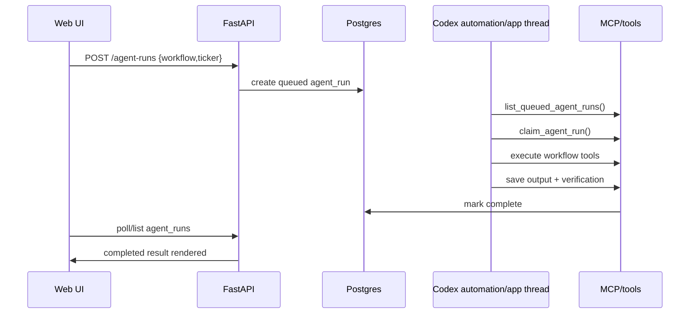

This avoids needing the frontend to embed Codex. The app queues work; Codex
picks it up when running locally. If Codex is offline, the UI shows `queued`.

Agent routing:

- The UI stores requested `model_role`, not a fixed model.
- Codex chooses the actual model available in the current surface.
- The UI displays `queued`, `draft`, `verified`, `rejected`, or
  `needs-human`, never hidden in-progress reasoning.

## Hosted / n8n Automation Lane

When the app is hosted, keep the same queue boundary instead of putting a
subscription-entitled Codex model inside the backend.

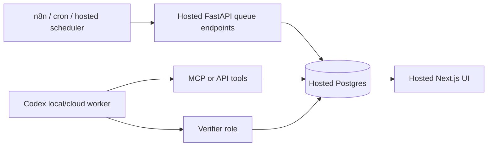

Practical rule:

- Hosted/n8n triggers `POST /api/agent-runs` or
  `POST /api/agent-runs/pre-session`; it does not need model credentials.
- Codex consumes queued work through the local stdio MCP server today.
- A hosted deployment can add a bearer-token protected Streamable HTTP MCP
  transport later, reusing the same tool functions and DB contracts.
- The UI remains passive and auditable: it displays queued work, completed
  verified outputs, rejected verifier results, and source links.

## Skills To Create

Repository skills live under `.agents/skills/` so Codex can discover them when
opened in this repo.

| Skill | Trigger | Primary model role | Output |
|---|---|---|---|
| `stock-pre-session-brief` | "prepare my session", scheduled morning/evening run | orchestrator + worker_standard + verifier_strict | verified daily agenda |
| `stock-quick-analysis` | "quick analyze TICKER" | worker_standard + verifier_strict | short verified analysis |
| `stock-deep-analysis` | "deep analyze TICKER" | orchestrator + worker_standard + analyst_deep + verifier_strict | full investment memo |
| `stock-candidate-scout` | "find candidates" | worker_standard + verifier_strict | candidate shortlist |
| `stock-backtest-review` | "backtest strategy/case" | worker_standard + analyst_deep + verifier_strict | backtest report |
| `stock-verifier` | explicit verification or called by other skills | verifier_strict | pass/fail checklist |

Each skill should use scripts/MCP tools for data access, never scrape directly
inside the prompt.

## MCP Tool Contract

Start with scripts, then wrap them in a local MCP server once the contract is
stable. Target tools:

| Tool | Purpose |
|---|---|
| `get_watchlist()` | Return watched companies and freshness. |
| `refresh_company(ticker, scope)` | Run existing polite refresh paths. |
| `refresh_watchlist(scope)` | Refresh watched tickers sequentially. |
| `poll_espi_watchlist()` | Fetch and upsert ESPI/EBI reports for watched companies. |
| `get_company_dossier(ticker)` | Return the same JSON the UI uses. |
| `get_recent_source_deltas(ticker, since)` | Source changes for a period. |
| `save_analysis_run(payload)` | Persist draft/verified/rejected analysis. |
| `save_agent_run(payload)` | Persist workflow execution metadata. |
| `mark_verification_result(payload)` | Attach verifier result. |
| `rank_candidates(source, limit)` | Deterministic prescreen plus saved rationale. |
| `run_backtest(strategy, from_date, to_date)` | Deterministic replay. |
| `evaluate_agent_runs(strategy, filters)` | Replay saved agent analyses against future outcomes. |
| `queue_agent_run(workflow, ticker)` | UI-created work request. |
| `list_queued_agent_runs()` | Codex pickup loop for UI requests. |
| `complete_agent_run(agent_run_id, output, verification_status)` | Close watchlist-level jobs that do not produce one company analysis row. |

All tools must return structured JSON and avoid secrets. Mutating tools need
clear status fields so Codex can report exactly what changed.

## Migration Work Packages

### CX.1 - Plan and contracts

Deliverables:

- This plan with diagrams.
- `TASKS.md` stage entries.
- Changelog entry.
- Decision recorded: Claude API path is deprecated and will be removed after
  provider-neutral storage and Codex save tools exist.

Acceptance:

- Flow diagrams cover scheduled, manual-chat, UI-requested, candidate and
  backtest paths.
- Each flow names the durable database result it produces.
- Simple/routine work is explicitly routed by risk to `worker_standard`, with
  `verifier_strict` supervising UI-visible results.
- No code/schema changes yet.

### CX.2 - Provider-neutral storage

Deliverables:

- Add `analysis_runs`, `agent_runs`, `verification_runs`, `event_reports`,
  `candidate_runs`, and `backtest_runs` or an intentionally smaller first
  subset if migration risk argues for it.
- Keep existing `analyses` readable until UI migration is done.
- Store `input_snapshot` for every Codex-created analysis.

Acceptance:

- Alembic migration and model parity tests pass.
- API can list old analyses and new analysis runs.
- UI can render at least a basic history from the new table.
- `model_role`, `model`, `workflow`, `agent_run_id`, and
  `verification_status` are persisted for Codex-created outputs.

### CX.3 - Local script contract

Deliverables:

- `backend/scripts/codex_get_dossier.py`
- `backend/scripts/codex_save_analysis.py`
- `backend/scripts/codex_poll_espi.py`
- `backend/scripts/codex_candidate_scan.py`
- `backend/scripts/codex_run_backtest.py`

Acceptance:

- Every script prints JSON and exits non-zero on failure.
- Scripts never expose secrets.
- Save scripts require `workflow`, `model_role`, `model`, and
  `verification_status`.
- `codex_save_analysis.py` can save a verified manual fixture and the UI shows it.

### CX.4 - Repo skills

Status: complete 2026-07-09.

Deliverables:

- `.agents/skills/stock-quick-analysis/SKILL.md`
- `.agents/skills/stock-deep-analysis/SKILL.md`
- `.agents/skills/stock-pre-session-brief/SKILL.md`
- `.agents/skills/stock-candidate-scout/SKILL.md`
- `.agents/skills/stock-backtest-review/SKILL.md`
- `.agents/skills/stock-verifier/SKILL.md`

Acceptance:

- Skills use scripts/MCP tools only for app data.
- Skills route subtasks to `worker_standard` by precision/risk.
- Every analysis-producing skill calls the verifier path before saving a
  visible result.
- Prompt instructions require labelled gaps instead of invented facts.
- Skill folders validate with the Codex skill validator.

### CX.5 - MCP server

Status: complete 2026-07-09 for the first local stdio slice.

Deliverables:

- Local MCP server wrapping the stable script/API contract.
- Project `.codex/config.toml` or documented user config for enabling it.
- Tool approval policy documented for mutating tools.

Acceptance:

- Codex can call `get_company_dossier`, `save_analysis_run`, and
  `list_queued_agent_runs` through MCP.
- Mutating tools require explicit structured input and return changed row IDs.
- Skills prefer MCP tools first and keep script fallbacks.
- ESPI and backtest tools honestly return contract-only statuses until CX.6/CX.8.

### CX.6 - ESPI/EBI ingestion

Status: complete 2026-07-09 for GPW first-page ingestion + scheduled
pre-session queueing.

Deliverables:

- `scrapers/espi.py` or source-specific modules.
- `event_reports` upsert keyed by external report ID.
- Watchlist polling job and recent-delta API/tool.
- Scheduling-friendly `codex_pre_session.py` entrypoint that fetches events and
  queues a GPT/Codex `stock-pre-session-brief` run.

Acceptance:

- Fixture parser tests for at least one source.
- All HTTP goes through `scrapers/http.py`.
- Pre-session brief can include verified new reports.
- GPT/Codex feature exploration uses durable queues/MCP tools rather than chat
  memory: scheduled, manual, and UI-triggered flows can share the same tools.

### CX.7 - UI queue and results

Status: complete 2026-07-09 for the first queue/result UI slice.

Deliverables:

- UI can request a Codex workflow by creating a queued `agent_run`.
- Dashboard shows queued/running/completed/rejected state.
- Stock page renders verified Codex analysis, source links and verifier badge.
- HTTP/n8n-friendly pre-session endpoint fetches ESPI/EBI and queues the
  `stock-pre-session-brief` workflow.

Acceptance:

- App remains useful when Codex is offline: runs stay queued.
- Completed runs are visible after Codex saves results.
- Rejected runs show verifier reasons.
- Dashboard and stock Analysis tab use provider-neutral queue/result APIs.

### CX.8 - Backtest and learning loop

Status: complete 2026-07-09 for the first deterministic replay slice.

Deliverables:

- Point-in-time snapshot builder.
- Deterministic strategy replay.
- Outcome attachment and summary metrics.
- UI Backtest Lab.

Acceptance:

- Tests prove no future data enters a historical signal.
- Backtest output separates computed metrics from Codex interpretation.
- Strategy changes require a documented validation note.

Notes:

- The first engine uses stored quarterly income rows only when
  `ReportValue.scraped_at <= as_of_date`; current mutable company fields such
  as market cap are deliberately excluded from historical signal inputs until a
  historical source exists.
- Future price windows are stored only under `outcome`.
- Codex may interpret saved runs later, but deterministic Python owns the
  replay math.

### CX.9 - Codex-first UI + compatibility runway

Deliverables:

- Active UI path uses provider-neutral queue/result APIs only.
- Settings shows workflow status, not provider-key status.
- Legacy Phase-5 endpoints/modules are marked as compatibility, not active
  product direction.
- Obsolete docs are either compacted or clearly point to this plan.

Acceptance:

- Backend and frontend builds/tests pass.
- The app can show a Codex-saved verified analysis without Anthropic settings.
- `rg` sweeps show provider-specific names only in compatibility tests/modules,
  historical changelog/archive entries, or explicit migration notes.

2026-07-09 progress: first cleanup slice retired the user-facing legacy path.
The Analysis tab queues Codex workflows and renders provider-neutral
`analysis_runs`; Settings reads `/diagnostics/workflow-status` instead of a
provider-key check. Backend Phase-5 compatibility routes/modules remain until
the next removal/archive pass, so CX.9 is not complete yet.

### CX.10 - Legacy model-provider sunset/archive

Deliverables:

- Remove or archive provider-specific config, clients and smoke scripts.
- Replace direct Phase-5 analysis endpoint behavior with provider-neutral
  queue/save/read semantics or remove it after UI/API callers are gone.
- Move historical docs/tests that still describe the old path to explicit
  archive sections.

Acceptance:

- `rg -n "Claude|ANTHROPIC|anthropic"` returns only historical archive entries
  and explicit migration notes.
- Provider-neutral `analysis_runs` cover the user-facing workflows that the old
  direct analysis endpoint covered.
- Backend and frontend tests pass without provider-specific settings.

Model routing:

- Use `gpt-5.3-codex-spark` for dead-reference sweeps, test inventory and draft
  removal plans.
- Use 5.5 supervision for the actual keep/remove decision and any endpoint
  contract change.

### CX.11 - Backtest data readiness + prediction learning

Deliverables:

- Historical availability boundary for financial rows: report publication date,
  source snapshot date, or a documented conservative lag policy.
- Expanded historical price coverage enough to evaluate 30/90/180/365-day
  outcome windows.
- Multi-asset walk-forward review that separates deterministic signal math from
  Codex interpretation.
- Learning notes that record false positives, false negatives, missing data and
  proposed rule changes without look-ahead bias.

Acceptance:

- A multi-asset backtest produces non-empty fundamental signals, not only
  `insufficient_data`.
- Strategy changes are evaluated on separated train/validation periods.
- Any prediction-improvement conclusion passes `verifier_strict` before it is
  saved or shown as verified.

2026-07-09 progress: deterministic replay now has an opt-in
`estimated_period_lag` policy for research-only runs when exact report
publication timestamps are missing. The strict default remains `scraped_at`.
Estimated-lag runs persist the policy in `parameters` and mark data quality as
research-only / needs-human; they may support exploration but not verified
strategy changes until better source dating and verifier review exist.

2026-07-09 progress: the dashboard Backtest Lab now makes stored replay runs
inspectable instead of hiding the evidence behind a summary row. The form keeps
strict `scraped_at` as the default and exposes `estimated_period_lag` as an
explicit research-mode selector. Expanding a saved run loads
`GET /api/backtest-runs/{id}` and shows the verifier status, policy note,
research warnings, observation checks and future outcome windows inline.

Model routing:

- Use `gpt-5.3-codex-spark` for repeated candidate scans, replay batches,
  anomaly summaries and table formatting.
- Use 5.5 `analyst_deep` for interpreting cross-company patterns.
- Use 5.5 `verifier_strict` for look-ahead, source-grounding and strategy-change
  review.

### CX.12 - Web-triggered / Codex-scheduled queue execution

Status: in progress 2026-07-09.

The backend remains a durable work queue, not an embedded Codex runtime. Web UI
buttons create `agent_runs`; a Codex thread, background worker or scheduled
Codex task claims and executes those rows through MCP/tools/scripts.

Current bridge:

- `backend/scripts/codex_pick_agent_run.py` lists or claims queued runs and
  returns an `execution_contract` for the relevant stock skill.
- `.codex/tasks/stock-queue-worker.md` is the reusable prompt for a manual,
  background or scheduled Codex run.
- `save_analysis_run` and `codex_save_analysis.py` close the original
  `agent_run` when an `agent_run_id` is supplied, writing output metadata,
  verification status and `finished_at`.
- Watchlist-level jobs such as `stock-candidate-scout` can be closed through
  MCP `complete_agent_run` or `backend/scripts/codex_complete_agent_run.py`
  when they do not produce a single company `analysis_run`.

2026-07-09 worker check: a supervised `gpt-5.3-codex-spark` worker tried to
claim `stock-candidate-scout` work using the queue prompt and correctly stopped
when the queue was empty. It did not run a scan or invent output without a
claimed durable row.

Acceptance:

- A web-created queued job can be claimed by a Codex-side process.
- Saving output for the claimed `agent_run_id` updates the original row to
  `completed`, `rejected` or `needs-human`.
- If Codex is offline, rows stay queued and the UI says they are waiting for a
  Codex/MCP worker rather than pretending they are running.
- Scheduled pre-session runs use the same queue and persistence path as manual
  web requests.

### CX.13 - Agent valuation backtests

Status: in progress 2026-07-09. Detailed plan:
`docs/plan-agent-valuation-backtest.md`.

Purpose: replay saved agent analyses and valuation memos against future
price/source outcomes. This evaluates model/workflow quality, not trading
orders.

Acceptance:

- The replay reads `analysis_runs.input_snapshot` and `analysis_runs.output`
  as the point-in-time prediction object.
- Future price windows attach only under `outcome`.
- Missing prediction fields or inferred prose directions mark the run
  `needs-human`.
- Any prompt, workflow or strategy change based on these evaluations requires
  separated validation periods and `verifier_strict`.

2026-07-09 progress: first deterministic slice implemented. Saved
`analysis_runs` can be replayed through `services/agent_evaluation.py`,
`POST /api/agent-evaluation-runs`, `backend/scripts/codex_evaluate_agent_runs.py`
and MCP `evaluate_agent_runs`. The parser only accepts structured direction or
potential fields; prose-only predictions remain `unknown` and require human
review.

2026-07-09 progress: the dashboard now has an "Agent Evaluation" panel in the
Backtest Lab area. It can create evaluation runs, list recent runs, expand
details, and show verifier status, structured prediction source, model role,
per-window outcomes and missing-data warnings.

### CX.14 - UI workbench refactor

Status: planned 2026-07-09. Detailed plan: `docs/plan-ui-refactor.md`.

The next UI direction is a modern analyst workbench: watchlist as the primary
surface, compact operations rail for queue/backtests/pre-session work, and
row-level provenance/status chips. Avoid a card-heavy marketing layout.

## Verification Protocol

Every work package after CX.1 uses the same loop:

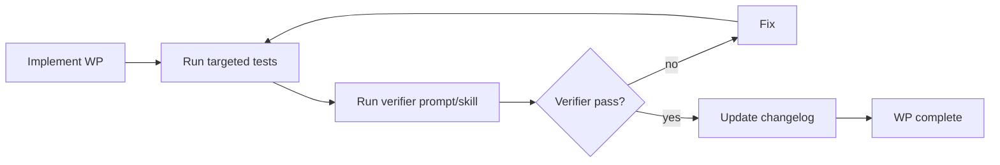

Verifier checklist:

- Source grounding: every numeric claim appears in the input snapshot,
  deterministic outputs, or cited source row.
- Role discipline: routine jobs used a model suitable for their precision risk,
  and the saved run explains any escalation to `analyst_deep`.
- Schema: required fields are present and valid.
- No look-ahead: historical analysis uses only data known at `as_of_date`.
- UI contract: saved result can render without special chat context.
- Safety: no secrets, no direct broad crawler, all scraper HTTP via
  `scrapers/http.py`.

## Non-Goals

- No public multi-user deployment in this stage.
- No direct frontend-to-Codex embedding.
- No backend dependency on ChatGPT subscription entitlements.
- No autonomous trading or buy/sell orders.
- No broad GPW crawler until source etiquette, fixtures and rate limits are
  implemented.
